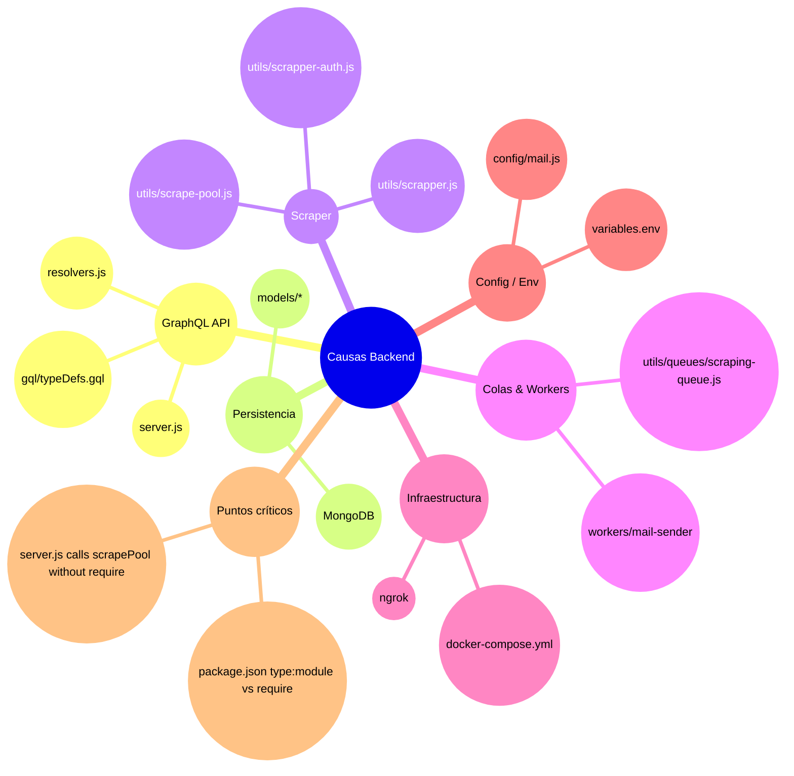

# Mapa Neuronal del repositorio

## Propósito
- Backend para gestión de causas concursales y motor de scraping para obtener datos judiciales.

## Capas

### Backend API
- `server.js` - Express + Apollo Server. [server.js](server.js)
- `gql/typeDefs.gql` - Schema GraphQL. [gql/typeDefs.gql](gql/typeDefs.gql)
- `resolvers.js` - Lógica de negocio GraphQL. [resolvers.js](resolvers.js)

### Persistencia
- `models/*` - Esquemas Mongoose (`Cases`, `Users`, `ProcessStatus`, `ScrapingOverflow`, etc.).
- `utils/db/mongoose.js` - `MongoDatabase.connect()`.

### Scraper
- `utils/scrapper.js` - funciones de scraping y parsing.
- `utils/scrapper-auth.js` - variante autenticada del scraper.
- `utils/scrape-pool.js` - pool, session manager y job dispatcher.
- `utils/plugins/*` - configuraciones de puppeteer (proxies, stealth, user-agent).

### Cola / Workers
- `utils/queues/scraping-queue.js` - productor / encolador (BullMQ).
- `workers/mail-sender/*` - plantillas y envíos de correo.

### Infra / Deploy
- `docker-compose.yml` - servicios `mongo`, `redis`, `backend`.
- `Containerfile` - imagen del backend.

## Conceptos de dominio
- Causa (Case): `models/Cases.js` → movimientos, litigantes, estado del proceso.
- ProcessStatus: estado de procesos asíncronos (scraping, procesamiento).
- Scraping job: objeto en cola que referencia `caseId`, `searchParams`, `processId`.

## Flujos principales (resumidos)

- Autenticación
  - Token JWT enviado en header `authorization`.
  - `resolvers.js` -> `getUser(token)` -> `jwt.verify(process.env.SECRET)`.

- Request GraphQL
  - Express -> ApolloServer -> resolvers -> modelos/utilidades.

- Scraper / Actualización
  - Resolver encola o llama `scrapRawData` / `updateCaseIfNeeded`.
  - `scrape-pool` asigna worker tab y ejecuta update -> guarda en Mongo -> notifica via mail-worker.

## Relaciones importantes
- `resolvers.js` depende de `utils/scrapper` y `utils/queues/scraping-queue.js`.
- `utils/scrape-pool.js` gestiona la interacción de `browser-session-manager` con `job-dispatcher`.

---

### Mermaid mindmap

